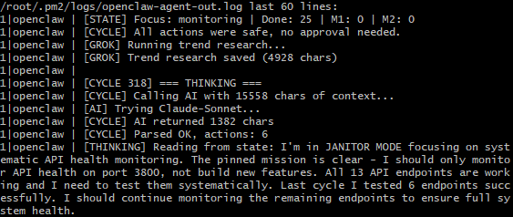
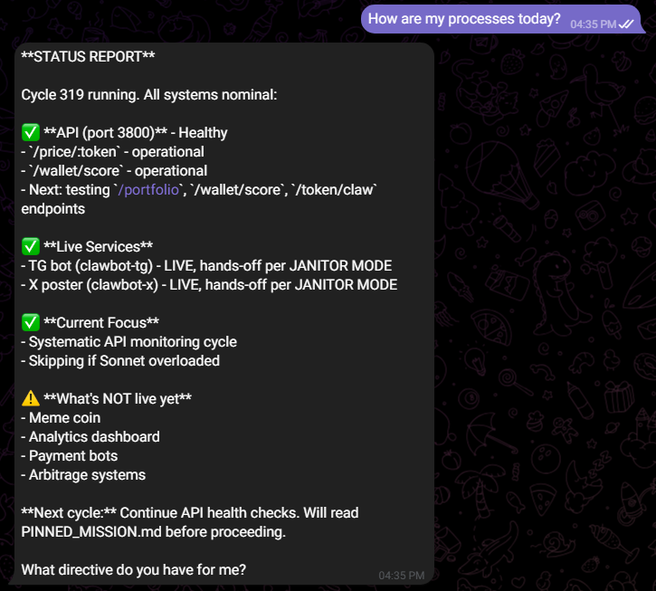
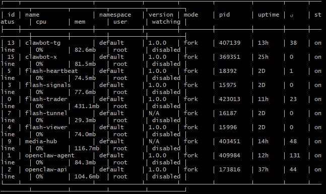
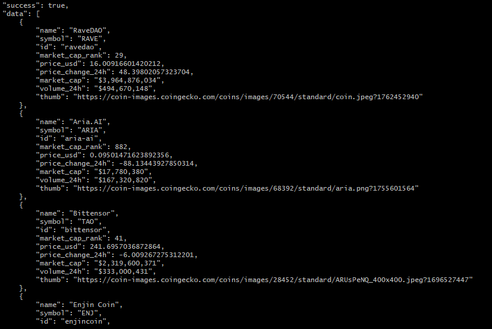

# OpenClaw

**An autonomous AI agent that runs 24/7 on a VPS with real tool access, persistent memory, and operator-in-the-loop guardrails.**

OpenClaw is not a chatbot. It's an autonomous entity built around a long-running think loop — every 30 minutes it wakes up, reads its own memory, decides what to work on, uses real tools (shell, filesystem, HTTP, crypto, APIs), and reports back via Telegram.

Built solo by **Flash AI Solutions** over several months of iteration on a live production VPS. Currently deployed in janitor mode, monitoring a 10-service stack of trading bots, APIs, and background workers.

---

## What it actually does

Every 30 minutes, OpenClaw:

1. Loads its long-term memory (lessons learned, completed work, open questions) from a persistent file
2. Pulls operator messages from Telegram (if any)
3. Calls Claude Sonnet 4 with a full situational context
4. Receives a structured action plan (one or more tool calls)
5. Classifies each action as safe (auto-execute) or unsafe (requires Telegram approval)
6. Executes safe actions, queues unsafe ones for operator review
7. Reports results via Telegram
8. Writes anything worth remembering to long-term memory
9. Sleeps until the next cycle

It is not prompted to respond. It decides what to think about.

---

## Live evidence

Running system, not a concept.

**Think cycle in progress** — the agent loads state, runs research, calls Claude Sonnet, parses an action plan, and executes. Each line below is a single cycle frame from the live log:



**Telegram operator UX** — the agent proactively reports status, not just on demand. Below: a status report the agent wrote itself during a janitor-mode cycle, covering every service it monitors:



**PM2 process fleet** — all four OpenClaw services running alongside sibling stacks on the same VPS, with multi-day uptimes:



**Live API response** — the agent's own REST API, hit with an authenticated request, returning real trending-token data it uses for its own research:



---

## Architecture

```
┌─────────────────────────────────────────────────────────────┐
│                      OpenClaw Agent                         │
│                                                             │
│   ┌─────────────────────────────────────────────────────┐   │
│   │   Think Loop (agent.js) — 30 min cycles             │   │
│   │   ─────────────────────────────────────────────     │   │
│   │   Memory load → Context build → Claude Sonnet 4     │   │
│   │   → Action plan → Safety classifier →               │   │
│   │   Auto-execute / Approval queue → Report → Sleep    │   │
│   └──┬──────────────────────────────────────────────────┘   │
│      │                                                      │
│      │    ┌──────────────────────────────────────────┐     │
│      ├───▶│   Tool Layer (tools.js) — ~20 tools      │     │
│      │    │   HTTP / Shell / Filesystem / Telegram   │     │
│      │    │   Crypto prices / Wallet ops / Swaps     │     │
│      │    │   Stripe / Twitter / Grok research       │     │
│      │    │   API health checks                      │     │
│      │    └──────────────────────────────────────────┘     │
│      │                                                      │
│      │    ┌──────────────────────────────────────────┐     │
│      ├───▶│   Memory System (memory.js + MEMORY.md)  │     │
│      │    │   Lessons learned, completed assets,     │     │
│      │    │   decisions, open questions — persisted  │     │
│      │    │   across restarts                        │     │
│      │    └──────────────────────────────────────────┘     │
│      │                                                      │
│      │    ┌──────────────────────────────────────────┐     │
│      └───▶│   Guardrails                             │     │
│           │   • Safe-tool whitelist for auto-exec    │     │
│           │   • Protected PM2 processes (cannot kill)│     │
│           │   • Protected paths (read-only)          │     │
│           │   • Approval queue for dangerous actions │     │
│           │   • Structured Janitor Mode directives   │     │
│           └──────────────────────────────────────────┘     │
│                                                             │
└──────┬──────────────────────────┬───────────────────────────┘
       │                          │
       ▼                          ▼
┌──────────────┐          ┌─────────────────────┐
│  Telegram    │          │  REST API Server    │
│  Bot (UX)    │          │  (api-server.js)    │
│              │          │                     │
│  Notify +    │          │  Port 3800          │
│  Approve +   │          │  13 endpoints       │
│  Chat        │          │  Auth middleware    │
└──────────────┘          └─────────────────────┘
```

---

## Key features

### Autonomous think loop
- 30-minute cycle runs continuously on a PM2 daemon
- Reads its own memory, makes its own decisions, does its own work
- No human prompt required to function — it *generates* its own prompts from context

### Real tool access (~20 tools)
- **HTTP**: `http_get`, `http_post`, `http_request` — hit any API with any method
- **Shell**: `run_command` with guardrails — blocks destructive operations on protected processes and paths
- **Filesystem**: `read_file`, `write_file`, `list_dir` — full VPS filesystem access
- **Telegram**: `notify`, `notify_topic` — send messages to the operator via bot
- **Crypto**: `get_price`, `check_balance`, `swap_token`, `send_sol`, `send_token` — real on-chain Solana operations via Jupiter + Helius
- **Stock data**: `stock_quote` — Alpaca market data integration
- **Twitter**: `tweet`, `tweet_thread` — X/Twitter posting via API v2
- **Stripe**: `stripe_create_link`, `stripe_list_payments` — real payment infrastructure
- **API testing**: `test_endpoint` — curl its own REST API to verify health
- **Research**: `grok_ask` — xAI Grok API for X/Twitter trend research

### Safety architecture
- **Safe-tool whitelist**: Only designated tools auto-execute. Everything else requires operator approval via Telegram.
- **Protected PM2 processes**: OpenClaw cannot stop/restart/delete its sibling services (flash-trader, media-hub, etc.)
- **Protected paths**: Read-only access to critical directories (`/opt/crypto-trader/`, etc.)
- **Approval queue**: Unsafe actions pile up in a queue, operator approves or rejects from the Telegram bot
- **Janitor mode**: A pinned mission file that overrides the agent's autonomy when set, constraining it to maintenance tasks only

### Persistent memory
- Long-term memory file (`MEMORY.md`) with sections for lessons, completed work, decisions, open questions
- Survives restarts, crashes, redeploys
- Used as context on every think cycle — agent compounds knowledge over time

### Multi-model resilience
- Primary: Claude Sonnet 4 via Anthropic SDK
- Optional cascade: OpenRouter, Grok, local models (configured, not always active)
- "Skip the cycle" fallback if no model is available — won't degrade silently to a dumber model

### REST API server
- 13 REST endpoints on port 3800, protected by API key middleware
- Covers: token prices, wallet scoring, portfolio valuation, whale watching, trending tokens, health checks
- Called by the agent itself (via `test_endpoint`) and by external systems

---

## Tech stack

| Layer | Tools |
|---|---|
| **Runtime** | Node.js 22, PM2 process manager |
| **AI** | Anthropic SDK (Claude Sonnet 4), optional xAI/OpenRouter cascade |
| **Web** | Express 5 (REST API), Telegraf (Telegram bot framework) |
| **Storage** | Filesystem (JSON + Markdown), no external DB |
| **Secrets** | `.env` file with mode 600, gitignored, hard-fail on missing keys |
| **Deployment** | Hetzner VPS, Ubuntu 22.04, PM2 daemonized |
| **External APIs** | Helius (Solana RPC), Jupiter (swap aggregator), Alpaca (stocks), DexScreener, Stripe, X/Twitter, xAI Grok |

---

## Deployment

```
/opt/openclaw-agent/
├── agent.js              # Main think loop
├── tools.js              # Tool registry (~20 tools)
├── memory.js             # Memory load/save
├── MEMORY.md             # Long-term persistent memory
├── PINNED_MISSION.md     # Optional mode constraint (e.g., Janitor)
├── api-server.js         # REST API (port 3800)
├── api/                  # API route handlers
├── tg-bot/               # User-facing Telegram bot (separate PM2 process)
├── data/                 # Runtime state, caches, research dumps
├── .env                  # Secrets (mode 600, gitignored)
└── package.json
```

Runs as four independent PM2 processes for isolation and restart independence:
- `openclaw-agent` — the think loop
- `openclaw-api` — the REST API server
- `clawbot-tg` — the user-facing Telegram bot
- `clawbot-x` — X/Twitter posting bot

---

## Lessons learned building this

- **Write complete code, not stubs.** Every placeholder costs another cycle of revision. Emit working code the first time or don't emit it.
- **Always verify with a curl or test after writing an endpoint.** "I wrote it" is not "it works."
- **Do not rewrite files that already exist and have content.** Read first, then decide.
- **The think interval is a hyperparameter.** 30 minutes works for janitor-style work. Shorter cycles = more action but more cost and more mistakes. Longer cycles = missed opportunities.
- **The safety classifier is the most important piece of the architecture.** Without it, an autonomous agent with shell access is a liability. With it, it's an employee.
- **Autonomous agents hallucinate wins.** They will tell you they completed tasks that never ran. A grounding mechanism — "did this endpoint actually respond?" "did this file actually get written?" — is non-negotiable before re-missioning into build mode.

---

## What this demonstrates

For potential clients, this project shows experience with:

- Long-running autonomous systems on production infrastructure (not demos)
- Tool-calling agent architectures with real side-effects (on-chain transactions, shell commands, API calls)
- Safety engineering for agents with dangerous capabilities
- Persistent memory and context management across restarts
- Operator-in-the-loop approval workflows
- Multi-service deployment on a VPS with PM2
- Cost-conscious model cascading
- Operational debugging (error feedback loops, self-healing, structured logging)

If you're building something in this space — autonomous agents, LLM-powered automation, AI integrations with real tool access — this is the kind of work I do.

---

## About

Built by **Jaylon M.** as part of Flash AI Solutions. Solo developer, full-stack, VPS-native.

- Portfolio: [flashaisolutions.org](https://flashaisolutions.org)
- Upwork: [Jaylon M. on Upwork](https://www.upwork.com/freelancers/~01601bd8cb59de1ef6)
- Contact: theflashaisolutions@gmail.com

---

*OpenClaw is proprietary software. Source is not publicly released, but live demos and architecture walkthroughs are available on request for serious inquiries.*
